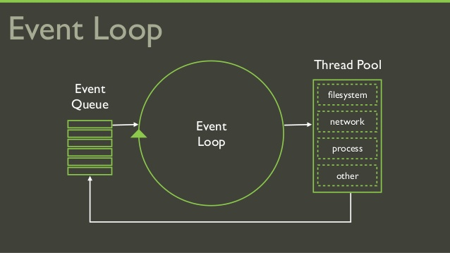

<p align="center">
    
</p>

# Study NodeJS :octocat:

## NodeJS是什么
NodeJS是一个平台， 提供javascript运行环境。  
NodeJS基于事件机制，异步执行。
可用于高并发开发。

## 事件机制
<p align="left">
    
</p>
Node.js 是单进程单线程应用程序，但是通过事件和回调支持并发，所以性能非常高。

Node.js 的每一个 API 都是异步的，并作为一个独立线程运行，使用异步函数调用，并处理并发。

Node.js 基本上所有的事件机制都是用设计模式中观察者模式实现。

Node.js 单线程类似进入一个while(true)的事件循环，直到没有事件观察者退出，每个异步事件都生成一个事件观察者，如果有事件发生就调用该回调函数.

## 优点 & 缺点
优点 | 缺点
----- | -----
事件机制，适于大规模系统 | 单线程运行，发生问题，可能会影响这个系统
使用Javascript - 很多多人都了解JS  | 也会有一些JS自身的bug
使用Gogoole用c++开发的V8 JS引擎 | 速度不比c/c++开发的服务快
有很多开源的NPM模块使用 | 开源的模块有些有恶意性代码

### 现有的JS引擎
企业或团体 | 引擎 
----- | -----
Internet Exploer | Chackra
Google | V8
Mozila | Spider Monkey
Apple | Squirrel Fish
Opera | Karakan 

## 安装
[http://nodejs.org](http://nodejs.org)
支持Windows, Linux, MacOS

## 运行代码模式

```javascript
>node
>colsole.log('Hello, World!');
Hello, World!
```
## 运行JS文件

helloWorld.js
```javascript
console.log('Hello, world!');
```

```javascript
>node helloWorld
Hello, world!
```

## NodeJS的全局对象
对象名称 | 说明
----- | -----
console | 提供关于console打印的功能
exports | 提供关于模块的功能
process | 提供关于程序有的功能


### console 对象
方法 | 说明
----- | -----
log |
info |
warn |
error |
dir |
time |
timeEnd |
trace |
assert |
Console |

### process 对象
属性名 | 说明
----- | -----
argv | 参数
env | 系统环境
version | NodeJS版本
versions | NodeJS版本和依赖模块的版本
arch | 系统的处理器
platform | 系统平台

process对象还有stdout，stdin,stderr等基本输出流方法。
还有kill, exit等方法。  
process对象是一个EventEmitter实例。
如果运行process.exit(), 可以用process.on('exit', function(err) {
    console.log(err);
})获取。

process.on('uncaughtException',()=>{}) 是截取异常的好方法吗？  
当发生error时怎么处理？

### exports 对象
exports用来定义被引入的方法，require方法来引用函数。
module.js
```javascript
    exports.add = (a, b) => {
        return a + b;
    };

    exports.mod = (a, b) => {
        return a % b;
    };
```

main.js
```javascript
    var module = require('./module.js');

    var sum = module.add(1, 3);
    console.log(sum);

    var mod = module.mod(7, 2);
    console.log(mod);
```

## 基本内部模块
模块名 | 作用
----- | -----
os | 获取系统信息
url | url字符串与url对象相互转换。组合url字符串
query strings | url字符串与url对象相互转换，url模块已有的功能，使用不多
util | 各种工具包模块
crypto | Hashing, 加密、解密功能
fs | 文件读写
http[s] | 有关http[s]模块的服务

还有path, tls/ssl, cluster, debugger, dns等包。  
可以访问[https://nodejs.org/dist/latest-v8.x/docs/api/](https://nodejs.org/dist/latest-v8.x/docs/api/) 最新的稳定版本的api。
## 外部模块
使用外部模块的时候需要安装 
```javascript 
    >npm install -g XXX
```
-g 选项可是全局选项，可以在任意地方使用这个模块。如果不设置，只能是在当前目录使用。  
--save 选项把当前模块的安装加入到package.json。  

有关页面的模块有ejs,jade  
让服务稳定运行的有supervisor, forever  
express模块提供http的功能，而且提供很多功能  
socket.io包提供socket功能